# 🥤 Smoothie Criminal

**"¿Blanquear dinero nunca fue tan refrescante... ni tan peligroso."**

¡Bienvenidos a **Smoothie Criminal**! Un *party-game* frenético donde la delincuencia se encuentra con el arte de preparar batidos. Sumérgete en una historia de mafia, alucinaciones y decisiones cuestionables.

---

## 🕹️ Juego
Actualmente en **fase preliminar (versión estable)** y disponible para **Windows**, *Smoothie Criminal* es una experiencia arcade que combina reflejos, memoria y caos absoluto.
Elige tu personaje y experimenta una maratón de minijuegos hasta agotar las vidas, la velocidad de los minijuegos irá incrementando gradualmente. 

### 📜 Historia
**Haznarito** ha decidido dejar la vida criminal, pero hay un pequeño detalle: se llevó consigo una maleta llena de dinero. Para limpiar su historial (y su fortuna), obtiene una licencia para vender Smoothies. Lo que parecía un negocio legítimo se tuerce cuando una clienta habitual empieza a pagar con unas pastillas de "dudosa procedencia". 

Tras consumirlas, la realidad de **Haznarito** se fractura y aparece **J.A.M.**, alter ego o manifestación alucinógena, llevando el juego a otro nivel de locura.

---

## 🎨 Estilo Visual y Personajes
Los jugadores podrán seleccionar entre **Haznarito** o **J.A.M.**, viviendo experiencias visuales totalmente distintas:

* **Haznarito:** Enfocado en la transición de criminal a empresario.
    * *Minijuegos:* En escala de grises con diseños mas grotescos.
* **J.A.M.:** La mente alterada por las alucinaciones.
    * *Minijuegos:* Estilo artístico colorido y surrealista protagonizados por distintas frutas.

---

## 🎮 Minijuegos (La Vida del Smoothie Criminal)

### La faceta "criminal" (Dinero fácil):
| **Patos:** Clásico Duck Hunt con un toque de locura | **Vaquero:** Dispara a los mafiosos evitando a los inocentes |
|-----------|-----------|
| 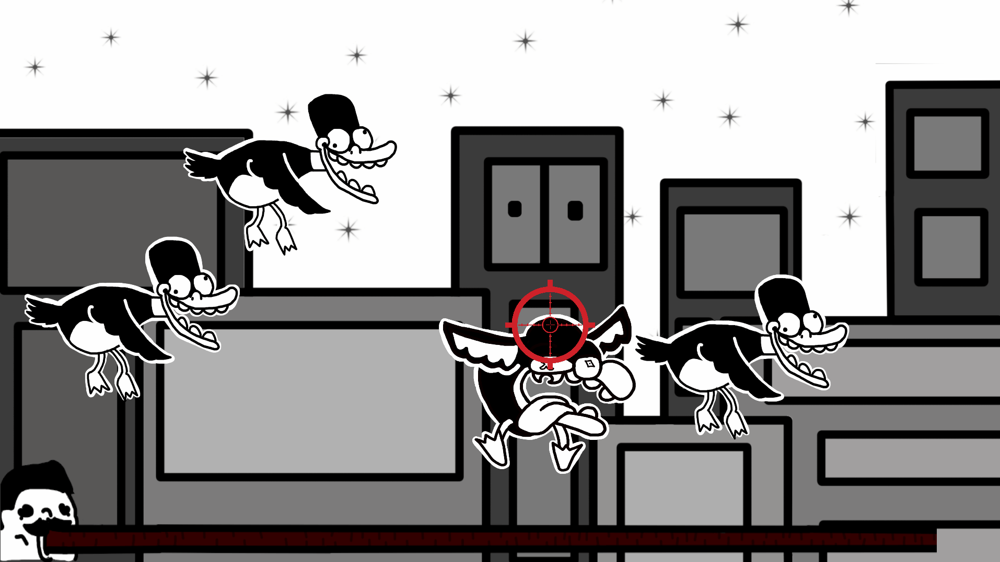 | 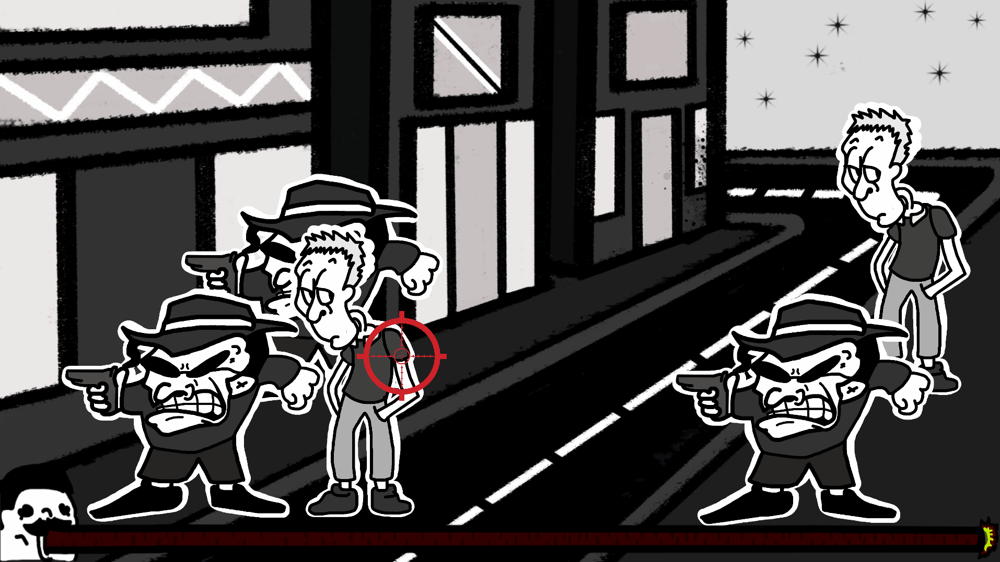 |
| **Nadar:** Huye anadando por el río antes de que el pez te coma | **Martillo:** Pulsa en el momento adecuado para eliminar al mafioso |
| 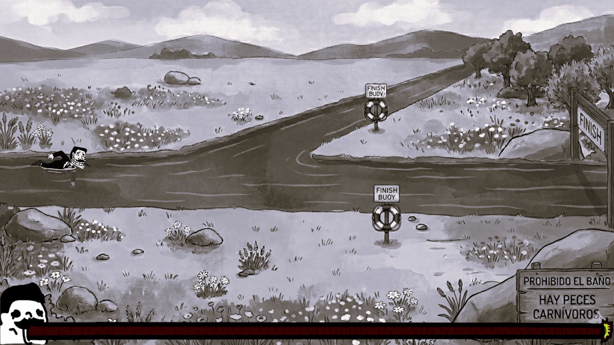 | 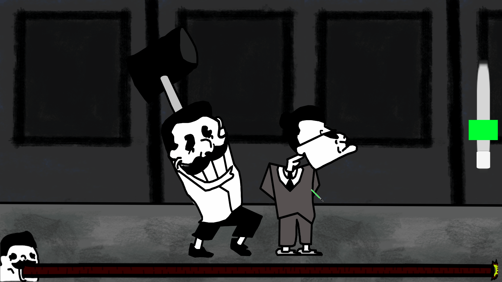 |
| **Nariz:** Introduce el dedo en movimiento en la nariz | **Globo:** Infla y explota el globo rápido |
| 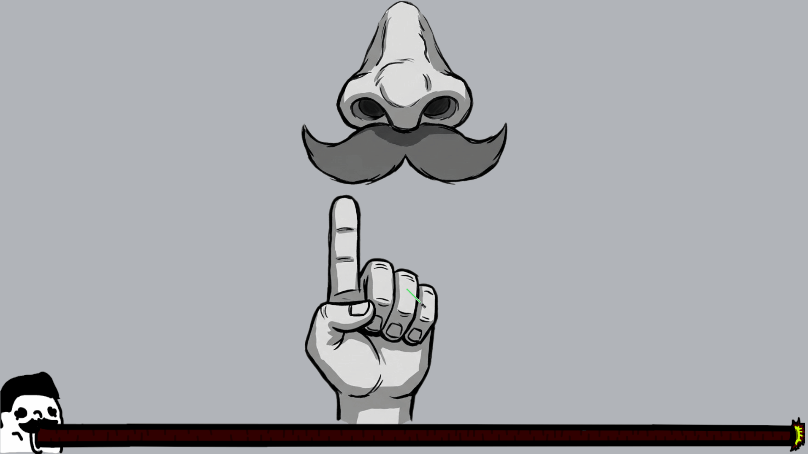 | 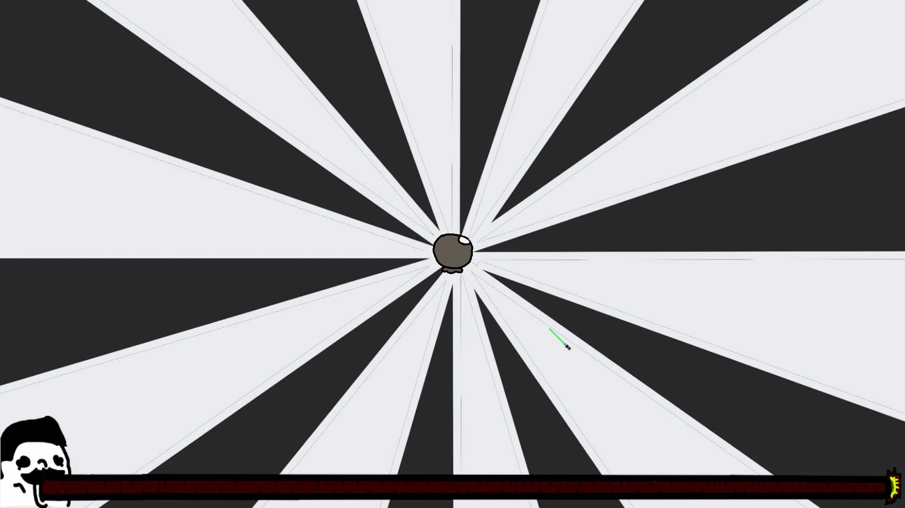 |
| **Penalti:** Golpea el balón y mete gol | 
| 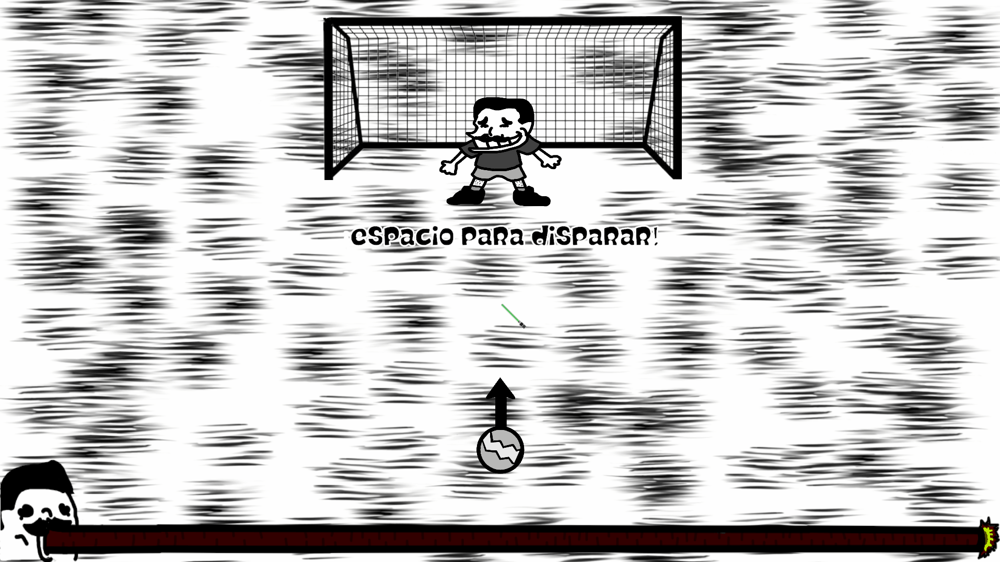 | 

### La faceta "empresarial" (Blanqueo de capitales):
| **Topos:** Clásico juego de los topos, golpea las frutas | **Basket:** Salta y lanza a canasta |
|-----------|-----------|
| 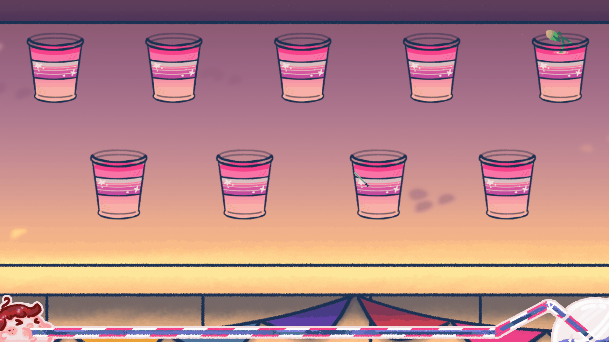 | 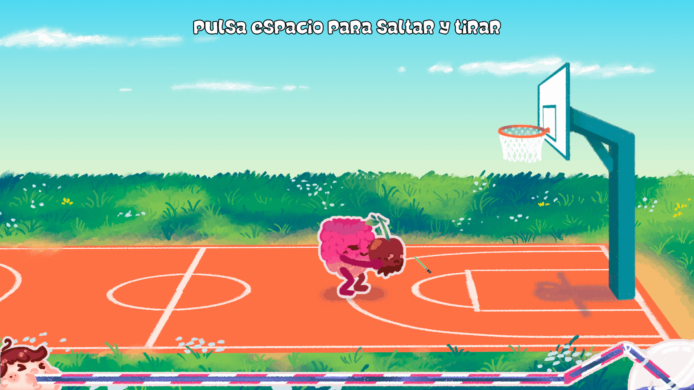 |
| **Carrera:** Trepidante carrera contra el tramposo Haznarito | **Trilero:** No pierdas de vista el vaso donde se enconde la fruta |
| 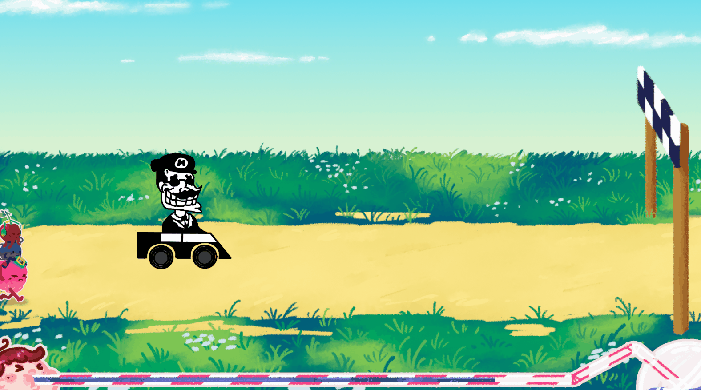 |  |
| **Cartas:** Memoriza la pareja de cartas y voltealas | **SimonDice:** Repite la secuencia de teclas correctamente |
| 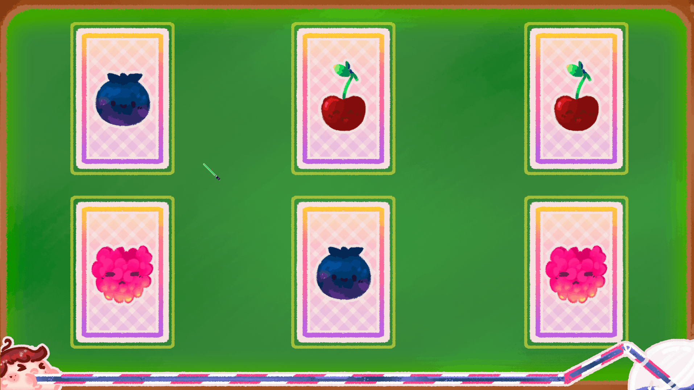 | 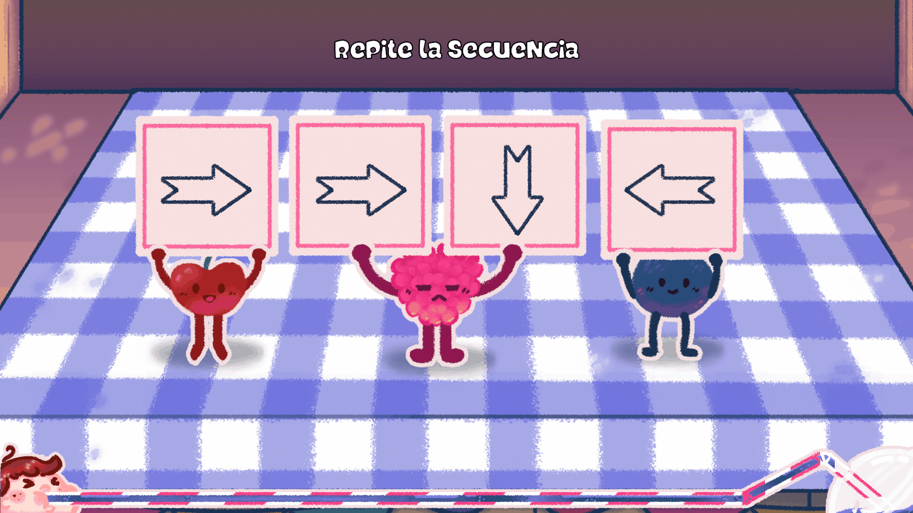 |
| **BuscarJAM:** El clásico Buscar a Wally, pero con frutas | **SimonDice:** Aplasta con el matamoscas a las frutas que se mueven |
| 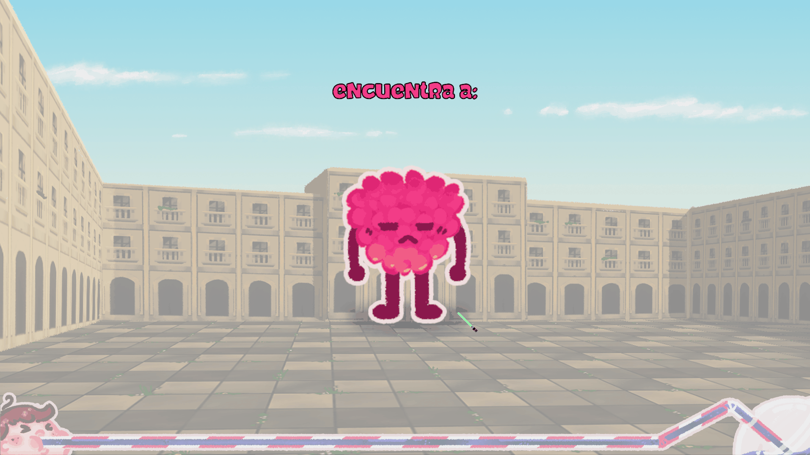 |  |
---

## 🚀 Cómo Empezar
1.  Descarga el ejecutable (.exe) desde la sección de **Builds** de este repositorio.
2.  ¡Ejecuta y empieza a blanquear!
3.  *Requisitos:* Windows 10/11.

---

## 👥 Equipo de Desarrollo

### 🎨 Equipo de Arte
* **Miguel Serrano** - *Lead Artist & Haznarito creator*
* **Claudia Trigo** - *Character Design & J.A.M. creator*

### 💻 Equipo de Programación
* **Álvaro Muñoz** - *Lead Developer & Game Designer*
* **Yeray Fernández** - *Developer*
* **Luis Miguel Muñoz** - *System Designer*

### 📝 Equipo de Diseño
* **Álvaro Jaime** - *Lead Designer*
* **Javier Gómez** - *UI Designer*

---

## 📜 Licencia
Este proyecto es un experimento de desarrollo independiente. *Si te ha gustado, no olvides seguirnos para próximas actualizaciones de contenido y nuevos minijuegos.*

---
*Hecho para gamers que saben que, a veces, un buen batido es la mejor tapadera.*
